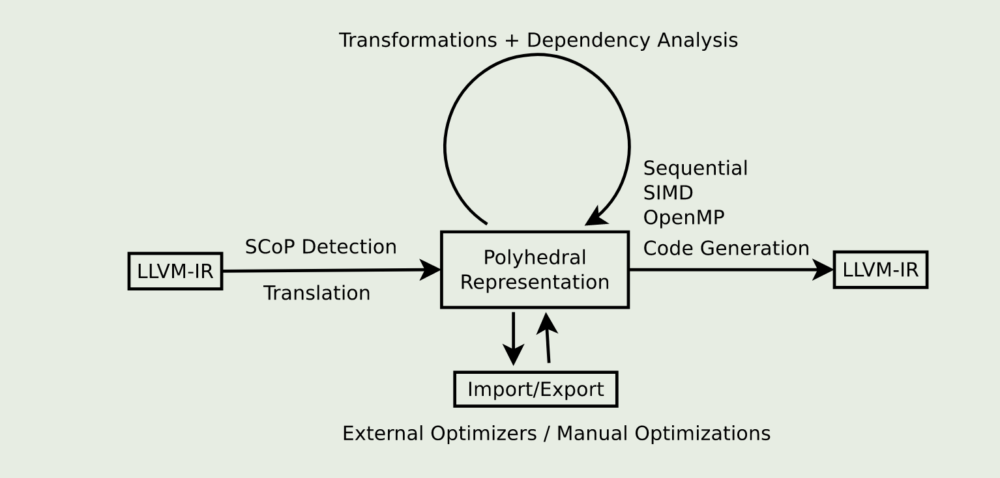

1.build llvm polly
```
mkdir build && cd build

cmake -G Ninja \
  -DLLVM_ENABLE_PROJECTS="clang;polly" \
  -DCMAKE_BUILD_TYPE=Debug \
  -DLLVM_ENABLE_ASSERTIONS=ON \
  -DCMAKE_CXX_STANDARD=11 \
  -DLLVM_TARGETS_TO_BUILD="X86" \
  ../llvm
  
ninja -j10
```


 df -h
Filesystem      Size  Used Avail Use% Mounted on
tmpfs           7.1G  2.4M  7.1G   1% /run
/dev/nvme0n1p2  937G  626G  264G  71% /
tmpfs            36G     0   36G   0% /dev/shm
tmpfs           5.0M   16K  5.0M   1% /run/lock
efivarfs        128K   28K   96K  23% /sys/firmware/efi/efivars
tmpfs            36G     0   36G   0% /run/qemu
/dev/nvme0n1p1  1.1G  6.2M  1.1G   1% /boot/efi
tmpfs           7.1G   84K  7.1G   1% /run/user/1007
tmpfs           7.1G   84K  7.1G   1% /run/user/1003


~/codespace/llvm-project/build$ du -sh 
4.3G    .
sunteng@zhimin-M12SWA-TF:~/codespace/llvm-project/build$ df -h
Filesystem      Size  Used Avail Use% Mounted on
tmpfs           7.1G  2.3M  7.1G   1% /run
/dev/nvme0n1p2  937G  631G  259G  71% /
tmpfs            36G     0   36G   0% /dev/shm
tmpfs           5.0M   16K  5.0M   1% /run/lock
efivarfs        128K   28K   96K  23% /sys/firmware/efi/efivars
tmpfs            36G     0   36G   0% /run/qemu
/dev/nvme0n1p1  1.1G  6.2M  1.1G   1% /boot/efi
tmpfs           7.1G   84K  7.1G   1% /run/user/1003

## 版本
```
git status 
HEAD detached at origin/release/20.x

git checkout -b dev-polly
```





### 分三个阶段：

1. Scop检测 llvm ir，检测成功后生成 polyhedral representation

2. analysis + transformation pass 

3. codegen llvm ir

### scop 检测：
ScopBuild.h
ScopBuild.cpp

### 优化pass
规范化：
Canonicalization.cpp

循环变换实现：
ScheduleOptimizer.cpp
ScheduleTreeTransform.cpp

矩阵乘法：
MatmulOptimizer.cpp


### codegen 
CodeGeneration.cpp

我喜欢系统思考。


### 测试

#### 1.create llvm-ir from the C code
```
cd /home/sunteng/codespace/llvm-project/polly-demo
../build/bin/clang -S -emit-llvm matmul.c -Xclang -disable-O0-optnone -o matmul.ll

```

#### 2.Prepare the llvm-ir for polly

```
../build/bin/opt -S -polly-canonicalize matmul.ll  -o matmul.preopt.ll

```

#### 3.
../build/bin/opt --basicaa -polly-ast -analyze matmul.preopt.ll -polly-process-unprofitable -polly-use-llvm-names

```
Printing analysis 'Basic Alias Analysis (stateless AA impl)' for function 'init_array':
Pass::print not implemented for pass: 'Basic Alias Analysis (stateless AA impl)'!
Printing analysis 'Polly - Generate an AST from the SCoP (isl)' for region: 'for.body3 => for.inc17' in function 'init_array':
Printing analysis 'Polly - Generate an AST from the SCoP (isl)' for region: 'for.cond1.preheader => for.end19' in function 'init_array':
:: isl ast :: init_array :: %for.cond1.preheader---%for.end19

if (1)

    for (int c0 = 0; c0 <= 1535; c0 += 1)
      for (int c1 = 0; c1 <= 1535; c1 += 1)
        Stmt_for_body3(c0, c1);

else
    {  /* original code */ }

Printing analysis 'Polly - Generate an AST from the SCoP (isl)' for region: 'entry => <Function Return>' in function 'init_array':
Printing analysis 'Basic Alias Analysis (stateless AA impl)' for function 'print_array':
Pass::print not implemented for pass: 'Basic Alias Analysis (stateless AA impl)'!
Printing analysis 'Polly - Generate an AST from the SCoP (isl)' for region: 'for.body3 => for.inc' in function 'print_array':
Printing analysis 'Polly - Generate an AST from the SCoP (isl)' for region: 'for.body3 => for.end' in function 'print_array':
Printing analysis 'Polly - Generate an AST from the SCoP (isl)' for region: 'for.cond1.preheader => for.end12' in function 'print_array':
Printing analysis 'Polly - Generate an AST from the SCoP (isl)' for region: 'entry => <Function Return>' in function 'print_array':
Printing analysis 'Basic Alias Analysis (stateless AA impl)' for function 'main':
Pass::print not implemented for pass: 'Basic Alias Analysis (stateless AA impl)'!
Printing analysis 'Polly - Generate an AST from the SCoP (isl)' for region: 'for.body8 => for.inc25' in function 'main':
Printing analysis 'Polly - Generate an AST from the SCoP (isl)' for region: 'for.body3 => for.inc28' in function 'main':
Printing analysis 'Polly - Generate an AST from the SCoP (isl)' for region: 'for.cond1.preheader => for.end30' in function 'main':
:: isl ast :: main :: %for.cond1.preheader---%for.end30

if (1)

    for (int c0 = 0; c0 <= 1535; c0 += 1)
      for (int c1 = 0; c1 <= 1535; c1 += 1) {
        Stmt_for_body3(c0, c1);
        for (int c2 = 0; c2 <= 1535; c2 += 1)
          Stmt_for_body8(c0, c1, c2);
      }

else
    {  /* original code */ }

Printing analysis 'Polly - Generate an AST from the SCoP (isl)' for region: 'entry => <Function Return>' in function 'main':
```


#### 5. View the polyhedral representation of the SCoPs

../build/bin/opt -polly-use-llvm-names --basicaa -polly-scops -analyze matmul.preopt.ll -polly-process-unprofitable


```
Printing analysis 'Basic Alias Analysis (stateless AA impl)' for function 'init_array':
Pass::print not implemented for pass: 'Basic Alias Analysis (stateless AA impl)'!
Printing analysis 'Polly - Create polyhedral description of Scops' for region: 'for.body3 => for.inc17' in function 'init_array':
Invalid Scop!
Printing analysis 'Polly - Create polyhedral description of Scops' for region: 'for.cond1.preheader => for.end19' in function 'init_array':
    Function: init_array
    Region: %for.cond1.preheader---%for.end19
    Max Loop Depth:  2
    Invariant Accesses: {
    }
    Context:
    {  :  }
    Assumed Context:
    {  :  }
    Invalid Context:
    {  : false }
    Arrays {
        float MemRef_A[*][1536]; // Element size 4
        float MemRef_B[*][1536]; // Element size 4
    }
    Arrays (Bounds as pw_affs) {
        float MemRef_A[*][ { [] -> [(1536)] } ]; // Element size 4
        float MemRef_B[*][ { [] -> [(1536)] } ]; // Element size 4
    }
    Alias Groups (0):
        n/a
    Statements {
        Stmt_for_body3
            Domain :=
                { Stmt_for_body3[i0, i1] : 0 <= i0 <= 1535 and 0 <= i1 <= 1535 };
            Schedule :=
                { Stmt_for_body3[i0, i1] -> [i0, i1] };
            MustWriteAccess :=  [Reduction Type: NONE] [Scalar: 0]
                { Stmt_for_body3[i0, i1] -> MemRef_A[i0, i1] };
            MustWriteAccess :=  [Reduction Type: NONE] [Scalar: 0]
                { Stmt_for_body3[i0, i1] -> MemRef_B[i0, i1] };
    }
Printing analysis 'Polly - Create polyhedral description of Scops' for region: 'entry => <Function Return>' in function 'init_array':
Invalid Scop!
Printing analysis 'Basic Alias Analysis (stateless AA impl)' for function 'print_array':
Pass::print not implemented for pass: 'Basic Alias Analysis (stateless AA impl)'!
Printing analysis 'Polly - Create polyhedral description of Scops' for region: 'for.body3 => for.inc' in function 'print_array':
Invalid Scop!
Printing analysis 'Polly - Create polyhedral description of Scops' for region: 'for.body3 => for.end' in function 'print_array':
Invalid Scop!
Printing analysis 'Polly - Create polyhedral description of Scops' for region: 'for.cond1.preheader => for.end12' in function 'print_array':
Invalid Scop!
Printing analysis 'Polly - Create polyhedral description of Scops' for region: 'entry => <Function Return>' in function 'print_array':
Invalid Scop!
Printing analysis 'Basic Alias Analysis (stateless AA impl)' for function 'main':
Pass::print not implemented for pass: 'Basic Alias Analysis (stateless AA impl)'!
Printing analysis 'Polly - Create polyhedral description of Scops' for region: 'for.body8 => for.inc25' in function 'main':
Invalid Scop!
Printing analysis 'Polly - Create polyhedral description of Scops' for region: 'for.body3 => for.inc28' in function 'main':
Invalid Scop!
Printing analysis 'Polly - Create polyhedral description of Scops' for region: 'for.cond1.preheader => for.end30' in function 'main':
    Function: main
    Region: %for.cond1.preheader---%for.end30
    Max Loop Depth:  3
    Invariant Accesses: {
    }
    Context:
    {  :  }
    Assumed Context:
    {  :  }
    Invalid Context:
    {  : false }
    Arrays {
        float MemRef_C[*][1536]; // Element size 4
        float MemRef_A[*][1536]; // Element size 4
        float MemRef_B[*][1536]; // Element size 4
    }
    Arrays (Bounds as pw_affs) {
        float MemRef_C[*][ { [] -> [(1536)] } ]; // Element size 4
        float MemRef_A[*][ { [] -> [(1536)] } ]; // Element size 4
        float MemRef_B[*][ { [] -> [(1536)] } ]; // Element size 4
    }
    Alias Groups (0):
        n/a
    Statements {
        Stmt_for_body3
            Domain :=
                { Stmt_for_body3[i0, i1] : 0 <= i0 <= 1535 and 0 <= i1 <= 1535 };
            Schedule :=
                { Stmt_for_body3[i0, i1] -> [i0, i1, 0, 0] };
            MustWriteAccess :=  [Reduction Type: NONE] [Scalar: 0]
                { Stmt_for_body3[i0, i1] -> MemRef_C[i0, i1] };
        Stmt_for_body8
            Domain :=
                { Stmt_for_body8[i0, i1, i2] : 0 <= i0 <= 1535 and 0 <= i1 <= 1535 and 0 <= i2 <= 1535 };
            Schedule :=
                { Stmt_for_body8[i0, i1, i2] -> [i0, i1, 1, i2] };
            ReadAccess :=       [Reduction Type: NONE] [Scalar: 0]
                { Stmt_for_body8[i0, i1, i2] -> MemRef_C[i0, i1] };
            ReadAccess :=       [Reduction Type: NONE] [Scalar: 0]
                { Stmt_for_body8[i0, i1, i2] -> MemRef_A[i0, i2] };
            ReadAccess :=       [Reduction Type: NONE] [Scalar: 0]
                { Stmt_for_body8[i0, i1, i2] -> MemRef_B[i2, i1] };
            MustWriteAccess :=  [Reduction Type: NONE] [Scalar: 0]
                { Stmt_for_body8[i0, i1, i2] -> MemRef_C[i0, i1] };
    }
Printing analysis 'Polly - Create polyhedral description of Scops' for region: 'entry => <Function Return>' in function 'main':
Invalid Scop!
```


#### 6. Show the dependences for the SCoPs 
../build/bin/opt -basicaa -polly-use-llvm-names -polly-dependences -analyze matmul.preopt.ll -polly-process-unprofitable

```
Printing analysis 'Basic Alias Analysis (stateless AA impl)' for function 'init_array':
Pass::print not implemented for pass: 'Basic Alias Analysis (stateless AA impl)'!
Printing analysis 'Polly - Calculate dependences' for region: 'for.body3 => for.inc17' in function 'init_array':
Printing analysis 'Polly - Calculate dependences' for region: 'for.cond1.preheader => for.end19' in function 'init_array':
        RAW dependences:
                {  }
        WAR dependences:
                {  }
        WAW dependences:
                {  }
        Reduction dependences:
                {  }
        Transitive closure of reduction dependences:
                {  }
Printing analysis 'Polly - Calculate dependences' for region: 'entry => <Function Return>' in function 'init_array':
Printing analysis 'Basic Alias Analysis (stateless AA impl)' for function 'print_array':
Pass::print not implemented for pass: 'Basic Alias Analysis (stateless AA impl)'!
Printing analysis 'Polly - Calculate dependences' for region: 'for.body3 => for.inc' in function 'print_array':
Printing analysis 'Polly - Calculate dependences' for region: 'for.body3 => for.end' in function 'print_array':
Printing analysis 'Polly - Calculate dependences' for region: 'for.cond1.preheader => for.end12' in function 'print_array':
Printing analysis 'Polly - Calculate dependences' for region: 'entry => <Function Return>' in function 'print_array':
Printing analysis 'Basic Alias Analysis (stateless AA impl)' for function 'main':
Pass::print not implemented for pass: 'Basic Alias Analysis (stateless AA impl)'!
Printing analysis 'Polly - Calculate dependences' for region: 'for.body8 => for.inc25' in function 'main':
Printing analysis 'Polly - Calculate dependences' for region: 'for.body3 => for.inc28' in function 'main':
Printing analysis 'Polly - Calculate dependences' for region: 'for.cond1.preheader => for.end30' in function 'main':
        RAW dependences:
                { Stmt_for_body3[i0, i1] -> Stmt_for_body8[i0, i1, 0] : 0 <= i0 <= 1535 and 0 <= i1 <= 1535; Stmt_for_body8[i0, i1, i2] -> Stmt_for_body8[i0, i1, 1 + i2] : 0 <= i0 <= 1535 and 0 <= i1 <= 1535 and 0 <= i2 <= 1534 }
        WAR dependences:
                { Stmt_for_body8[i0, i1, i2] -> Stmt_for_body8[i0, i1, 1 + i2] : 0 <= i0 <= 1535 and 0 <= i1 <= 1535 and 0 <= i2 <= 1534 }
        WAW dependences:
                { Stmt_for_body3[i0, i1] -> Stmt_for_body8[i0, i1, 0] : 0 <= i0 <= 1535 and 0 <= i1 <= 1535; Stmt_for_body8[i0, i1, i2] -> Stmt_for_body8[i0, i1, 1 + i2] : 0 <= i0 <= 1535 and 0 <= i1 <= 1535 and 0 <= i2 <= 1534 }
        Reduction dependences:
                {  }
        Transitive closure of reduction dependences:
                {  }
Printing analysis 'Polly - Calculate dependences' for region: 'entry => <Function Return>' in function 'main':
```


#### 7. Export jscop files
../build/bin/opt -basicaa -polly-use-llvm-names -polly-export-jscop matmul.preopt.ll -polly-process-unprofitable

```
WARNING: You're attempting to print out a bitcode file.
This is inadvisable as it may cause display problems. If
you REALLY want to taste LLVM bitcode first-hand, you
can force output with the `-f' option.

Writing JScop '%for.cond1.preheader---%for.end19' in function 'init_array' to './init_array___%for.cond1.preheader---%for.end19.jscop'.

Writing JScop '%for.cond1.preheader---%for.end30' in function 'main' to './main___%for.cond1.preheader---%for.end30.jscop'.

```

#### 8.Import the changed jscop files and print the updated SCoP structure (optional)¶

**No Polly**
```

../build/bin/opt -basicaa -polly-use-llvm-names matmul.preopt.ll -polly-import-jscop -polly-ast -analyze -polly-process-unprofitable

Printing analysis 'Basic Alias Analysis (stateless AA impl)' for function 'init_array':
Pass::print not implemented for pass: 'Basic Alias Analysis (stateless AA impl)'!
Printing analysis 'Polly - Import Scops from JSON (Reads a .jscop file for each Scop)' for region: 'for.body3 => for.inc17' in function 'init_array':
Printing analysis 'Polly - Generate an AST from the SCoP (isl)' for region: 'for.body3 => for.inc17' in function 'init_array':
Reading JScop '%for.cond1.preheader---%for.end19' in function 'init_array' from './init_array___%for.cond1.preheader---%for.end19.jscop'.
Printing analysis 'Polly - Import Scops from JSON (Reads a .jscop file for each Scop)' for region: 'for.cond1.preheader => for.end19' in function 'init_array':
    Function: init_array
    Region: %for.cond1.preheader---%for.end19
    Max Loop Depth:  2
    Invariant Accesses: {
    }
    Context:
    {  :  }
    Assumed Context:
    {  :  }
    Invalid Context:
    {  : false }
    Arrays {
        float MemRef_A[*][1536]; // Element size 4
        float MemRef_B[*][1536]; // Element size 4
    }
    Arrays (Bounds as pw_affs) {
        float MemRef_A[*][ { [] -> [(1536)] } ]; // Element size 4
        float MemRef_B[*][ { [] -> [(1536)] } ]; // Element size 4
    }
    Alias Groups (0):
        n/a
    Statements {
        Stmt_for_body3
            Domain :=
                { Stmt_for_body3[i0, i1] : 0 <= i0 <= 1535 and 0 <= i1 <= 1535 };
            Schedule :=
                { Stmt_for_body3[i0, i1] -> [i0, i1] };
            MustWriteAccess :=  [Reduction Type: NONE] [Scalar: 0]
                { Stmt_for_body3[i0, i1] -> MemRef_A[i0, i1] };
            MustWriteAccess :=  [Reduction Type: NONE] [Scalar: 0]
                { Stmt_for_body3[i0, i1] -> MemRef_B[i0, i1] };
    }
Printing analysis 'Polly - Generate an AST from the SCoP (isl)' for region: 'for.cond1.preheader => for.end19' in function 'init_array':
:: isl ast :: init_array :: %for.cond1.preheader---%for.end19

if (1)

    for (int c0 = 0; c0 <= 1535; c0 += 1)
      for (int c1 = 0; c1 <= 1535; c1 += 1)
        Stmt_for_body3(c0, c1);

else
    {  /* original code */ }

Printing analysis 'Polly - Import Scops from JSON (Reads a .jscop file for each Scop)' for region: 'entry => <Function Return>' in function 'init_array':
Printing analysis 'Polly - Generate an AST from the SCoP (isl)' for region: 'entry => <Function Return>' in function 'init_array':
Printing analysis 'Basic Alias Analysis (stateless AA impl)' for function 'print_array':
Pass::print not implemented for pass: 'Basic Alias Analysis (stateless AA impl)'!
Printing analysis 'Polly - Import Scops from JSON (Reads a .jscop file for each Scop)' for region: 'for.body3 => for.inc' in function 'print_array':
Printing analysis 'Polly - Generate an AST from the SCoP (isl)' for region: 'for.body3 => for.inc' in function 'print_array':
Printing analysis 'Polly - Import Scops from JSON (Reads a .jscop file for each Scop)' for region: 'for.body3 => for.end' in function 'print_array':
Printing analysis 'Polly - Generate an AST from the SCoP (isl)' for region: 'for.body3 => for.end' in function 'print_array':
Printing analysis 'Polly - Import Scops from JSON (Reads a .jscop file for each Scop)' for region: 'for.cond1.preheader => for.end12' in function 'print_array':
Printing analysis 'Polly - Generate an AST from the SCoP (isl)' for region: 'for.cond1.preheader => for.end12' in function 'print_array':
Printing analysis 'Polly - Import Scops from JSON (Reads a .jscop file for each Scop)' for region: 'entry => <Function Return>' in function 'print_array':
Printing analysis 'Polly - Generate an AST from the SCoP (isl)' for region: 'entry => <Function Return>' in function 'print_array':
Printing analysis 'Basic Alias Analysis (stateless AA impl)' for function 'main':
Pass::print not implemented for pass: 'Basic Alias Analysis (stateless AA impl)'!
Printing analysis 'Polly - Import Scops from JSON (Reads a .jscop file for each Scop)' for region: 'for.body8 => for.inc25' in function 'main':
Printing analysis 'Polly - Generate an AST from the SCoP (isl)' for region: 'for.body8 => for.inc25' in function 'main':
Printing analysis 'Polly - Import Scops from JSON (Reads a .jscop file for each Scop)' for region: 'for.body3 => for.inc28' in function 'main':
Printing analysis 'Polly - Generate an AST from the SCoP (isl)' for region: 'for.body3 => for.inc28' in function 'main':
Reading JScop '%for.cond1.preheader---%for.end30' in function 'main' from './main___%for.cond1.preheader---%for.end30.jscop'.
Printing analysis 'Polly - Import Scops from JSON (Reads a .jscop file for each Scop)' for region: 'for.cond1.preheader => for.end30' in function 'main':
    Function: main
    Region: %for.cond1.preheader---%for.end30
    Max Loop Depth:  3
    Invariant Accesses: {
    }
    Context:
    {  :  }
    Assumed Context:
    {  :  }
    Invalid Context:
    {  : false }
    Arrays {
        float MemRef_C[*][1536]; // Element size 4
        float MemRef_A[*][1536]; // Element size 4
        float MemRef_B[*][1536]; // Element size 4
    }
    Arrays (Bounds as pw_affs) {
        float MemRef_C[*][ { [] -> [(1536)] } ]; // Element size 4
        float MemRef_A[*][ { [] -> [(1536)] } ]; // Element size 4
        float MemRef_B[*][ { [] -> [(1536)] } ]; // Element size 4
    }
    Alias Groups (0):
        n/a
    Statements {
        Stmt_for_body3
            Domain :=
                { Stmt_for_body3[i0, i1] : 0 <= i0 <= 1535 and 0 <= i1 <= 1535 };
            Schedule :=
                { Stmt_for_body3[i0, i1] -> [i0, i1, 0, 0] };
            MustWriteAccess :=  [Reduction Type: NONE] [Scalar: 0]
                { Stmt_for_body3[i0, i1] -> MemRef_C[i0, i1] };
        Stmt_for_body8
            Domain :=
                { Stmt_for_body8[i0, i1, i2] : 0 <= i0 <= 1535 and 0 <= i1 <= 1535 and 0 <= i2 <= 1535 };
            Schedule :=
                { Stmt_for_body8[i0, i1, i2] -> [i0, i1, 1, i2] };
            ReadAccess :=       [Reduction Type: NONE] [Scalar: 0]
                { Stmt_for_body8[i0, i1, i2] -> MemRef_C[i0, i1] };
            ReadAccess :=       [Reduction Type: NONE] [Scalar: 0]
                { Stmt_for_body8[i0, i1, i2] -> MemRef_A[i0, i2] };
            ReadAccess :=       [Reduction Type: NONE] [Scalar: 0]
                { Stmt_for_body8[i0, i1, i2] -> MemRef_B[i2, i1] };
            MustWriteAccess :=  [Reduction Type: NONE] [Scalar: 0]
                { Stmt_for_body8[i0, i1, i2] -> MemRef_C[i0, i1] };
    }
Printing analysis 'Polly - Generate an AST from the SCoP (isl)' for region: 'for.cond1.preheader => for.end30' in function 'main':
:: isl ast :: main :: %for.cond1.preheader---%for.end30

if (1)

    for (int c0 = 0; c0 <= 1535; c0 += 1)
      for (int c1 = 0; c1 <= 1535; c1 += 1) {
        Stmt_for_body3(c0, c1);
        for (int c3 = 0; c3 <= 1535; c3 += 1)
          Stmt_for_body8(c0, c1, c3);
      }

else
    {  /* original code */ }

Printing analysis 'Polly - Import Scops from JSON (Reads a .jscop file for each Scop)' for region: 'entry => <Function Return>' in function 'main':
Printing analysis 'Polly - Generate an AST from the SCoP (isl)' for region: 'entry => <Function Return>' in function 'main':

```


**Loop Interchange (and Fission to allow the interchange)** 

```
../build/bin/opt -basicaa -polly-use-llvm-names matmul.preopt.ll -polly-import-jscop -polly-import-jscop-postfix=interchanged -polly-ast -analyze -polly-process-unprofitable


```


**Interchange + Tiling**
```
../build/bin/opt -basicaa -polly-use-llvm-names matmul.preopt.ll -polly-import-jscop -polly-import-jscop-postfix=interchanged+tiled -polly-ast -analyze -polly-process-unprofitable

```

#### 9.


../build/bin/opt -polly -polly-export-jscop -polly-export-jscop-postfix=interchanged matmul.preopt.ll 

../build/bin/opt -basicaa -polly-use-llvm-names -polly-export-jscop matmul.preopt.ll -polly-process-unprofitable


../../../../build/bin/opt -basicaa -polly-use-llvm-names matmul.preopt.ll -polly-import-jscop -polly-import-jscop-postfix=interchanged -polly-ast -analyze -polly-process-unprofitable

../../../../build/bin/opt -basicaa -polly-use-llvm-names matmul.preopt.ll -polly-import-jscop -polly-import-jscop-postfix=interchanged+tiled -polly-ast -analyze -polly-process-unprofitable


../../../../build/bin/opt -basicaa -polly-use-llvm-names matmul.preopt.ll -polly-import-jscop -polly-import-jscop-postfix=interchanged+tiled -polly-ast -analyze -polly-process-unprofitable
